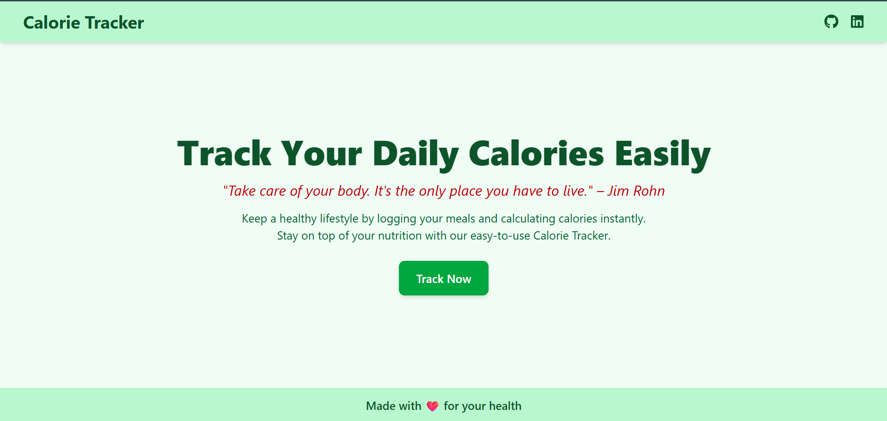
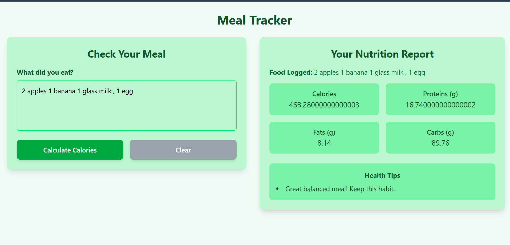
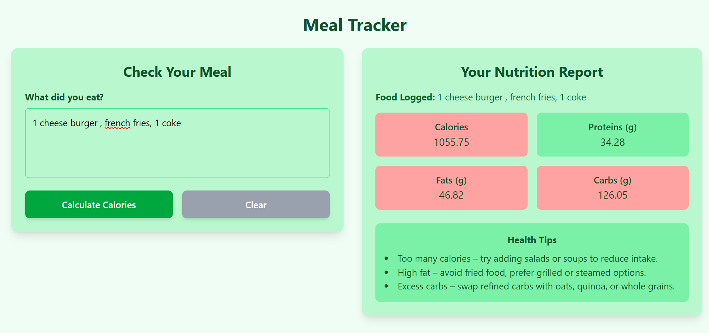

# Meal Tracker

Meal Tracker is a simple and effective web app that helps you log your meals and instantly calculate nutritional values such as Calories, Proteins, Fats, and Carbs. It also provides health tips to guide you toward smarter food choices.

---


---

## Features

- Log any meal in natural language (e.g., "2 chapati, 1 bowl dal, 1 glass milk").  
- Get instant nutrition breakdown: Calories, Proteins, Fats, and Carbs.  
- Smart health tips to maintain a balanced lifestyle.  
- Responsive user interface built with React.  
- Backend powered by Node.js/Express with nutrition API integration.

---

## Tech Stack

- Frontend: React + Vite + Tailwind  
- Backend: Node.js + Express  
- API: Nutrition data integration via [Nutritionix API](https://developer.nutritionix.com/login#)

---

## Review Images

### Home Page  


### Example Meal Report  


### Another Example  


---

## Setup Instructions

### Backend
1. Navigate to the backend folder:
```bash
cd backend
```
2. Install dependencies:
```bash
npm install
```
3. Start the backend server:
```bash
npm start
```

### Frontend
1. Navigate to the frontend folder:
```bash
cd frontend
```
2. Install dependencies:
```bash
npm install
```
3. Start the frontend server:
```bash
npm run dev
```

After starting both backend and frontend, open your browser at the port shown in your terminal (usually `http://localhost:5173`) to use the app.

---

## Usage

1. Open the app in your browser.  
2. Click the "Track Now" button on the home page.  
3. Enter your meal in natural language.  
4. View the instant nutrition report and smart health tips.

